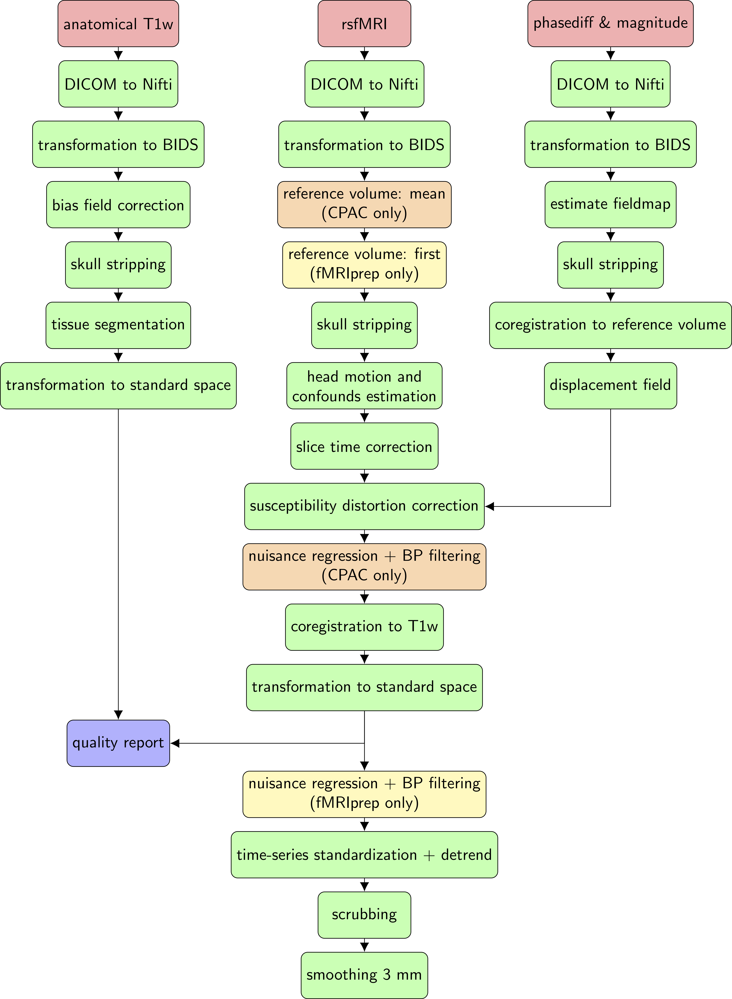

# Functional connectivity analysis in the human brain using ultra-high field MRI


# Project overview
README file for a master project in Bioinformatics
* BINP52 - Master project - 60 ECTS
* Master programme in Bioinformatics
* Department of Biology, Faculty of Science, Lund University, Sweden

The goal of this work was to compare two different rsfMRI preprocessing pipelines on a high-field MRI dataset of ten healthy subjects. The goal of this retrospective study was to evaluate the impact of specific modification in the preprocessing to extracted resting-state networks using independent component analysis. Further, to assess the reproducibility and robustness of networks between the different pipelines. The data was part of a larger study on Systemic Lupus Erytematosus at Lund University, Sweden. 


# People
* Student: Theodor Rumetshofer (theodor.rumetshofer@gmail.com)
* Supervisors: Peter Mannfolk (peter.mannfolk@med.lu.se) and Olof Strandberg (olof.strandberg@med.lu.se)
* Institute: Department of Clinical Science/Diagnostic Radiology, Faculty of Medicine, Lund University, Sweden
* Principial Investigator: Pia Sundgren Maly (pia.sundgren@med.lu.se)
* Corresponding author: Theodor Rumetshofer 


# Software versions
The following hardware was used:
* Apple Macbook Pro (mid-2015, macOS High Sierra 10.13.6) used for quality assessment, group-wise ICA analysis (GIFT) and to create the figures
* cluster machine "Poweredge" (Ubuntu 18.04.4) used for the preprocessing and the nuisance regression, normalization and scrubbing

The following software packages were used:
* fMRIprep v20.2.0
* CPAC v1.6.2
* GIFT v4.0c
* Matlab v2016b
* SPM v12
* Python Anaconda v3.6.7


# Installation

## fMRIprep
A docker container was used, see: https://fmriprep.org/en/stable/installation.html#container-technologies-docker-and-singularity

1) create environment
```bash
conda create --name fmriprep
```
2) activate environment
```bash
conda activate fmriprep
```
3) install docker image
```bash
docker pull poldracklab/fmriprep:20.2.0
```
4) install wrapper
```bash
python -m pip install --user --upgrade fmriprep-docker
```

## CPAC
For CPAC also a docker container was installed, see: https://fcp-indi.github.io/docs/latest/user/quick

1) create a new environment and activate it
```bash
conda create -n cpac python=3.6
source activate cpac
```
2) install cpac
```bash
pip install cpac
```
3) install docker
```bash
docker pull fcpindi/c-pac:latest
```

## GIFT
A non-compiled version of the GIFT packages was downloaded which was copied, without installation into the MATLAB toolbox folder.


# Preprocessing
An overview of all preprocessing steps can be seen in the image above. Those steps are separated in four different parts. 



## input data

1) The data is automatically transformed to the clinical server by transforming the DICOM-images to a NIFTI-image.
2) From the SLE 7T MRI project (number: 017) the following subjects were included: 116, 117, 119, 122, 126, 130, 131, 132, 133, 138
3) The following MRI files were copied from the archive: rsfMRI, T1w, phasediff, magnitude
4) The data was transformed to BIDS format (see: https://bids-specification.readthedocs.io/en/latest/04-modality-specific-files/01-magnetic-resonance-imaging-data.html#common-metadata-fields) using the in-house developed Python script ([data_bids.py](data_bids.py))
5) BIDS was tested using the following validator: https://bids-standard.github.io/bids-validator/

**No erros detected**

## Quality assessments of the input data
This was done visually using an in-house developed Python script ([data_QA.py](data_QA.py)).

**No abnormalities detected**

## fMRIprep
The fMRIprep docker container was tested on one subject first using combinations of different preprocessing steps. E.g. the "recon-all" modus to segment the brain was not used due to some unknown error. However, this analysis was not necessary for this work. Further, different output types as well as saving the working data were tested.

For the final command, a bash script ([pipeline_fmriprep_ppfMRIprep.sh](pipeline_fmriprep_ppfMRIprep.sh)) with a for-loop was used to preprocess the subjects sequentially. Additionally, the docker container was deleted to avoid a conflict that the next subject is called with the same container name.

```bash
#!/bin/bash

for f in $HOME/hd/SLE/DATA_7T/rsfmri_200909/Nifti_master/sub-*; do
sub=$(echo $f | awk -F 'sub-' '{print $2}' | cut -d"/" -f2)

echo subject $sub is started ...

docker run -itd --name ppfMRIprep -v $HOME/hd/SLE/DATA_7T/rsfmri_200909/Nifti_master:/data:ro -v $HOME/hd/SLE/DATA_7T/rsfmri_200909/ppfMRIprep/derivatives:/out -v $HOME/hd/SLE/DATA_7T/rsfmri_200909/ppfMRIprep/workdir:/worktemp -v $FREESURFER_HOME:/FS_folder poldracklab/fmriprep:20.2.0 /data /out/out participant --participant_label $sub --nproc 24 --bold2t1w-dof 9 --force-bbr --output-spaces T1w MNI152NLin6Asym --fs-no-reconall --use-aroma --stop-on-first-crash --fs-license-file /FS_folder/license.txt -w /worktemp --write-graph -v

docker wait ppfMRIprep
echo ...subject $sub is finished.
docker logs ppfMRIprep > $HOME/hd/SLE/DATA_7T/rsfmri_200909/$sub.log
docker container rm ppfMRIprep
echo docker removed
done
```

The preprocessing was executed with the nohub-command:

```bash
chmod +x pipeline_fmriprep_ppfMRIprep.sh
nohup sh pipeline_fmriprep_ppfMRIprep.sh > $HOME/hd/SLE/DATA_7T/rsfmri_200909/ppfMRIprep.log 2>&1 &
echo $! > $HOME/hd/SLE/DATA_7T/rsfmri_200909/save_pid_ppfMRIprep.txt
```

## CPAC
CPAC was also tested on a single subject before and different combinations of the different steps were used. The pipeline configuration file ([pipeline_config_ppCPAC.yml](pipeline_config_ppCPAC.yml)) was copied from the CPAC pipeline (see: https://fcp-indi.github.io/docs/nightly/user/pipelines/preconfig#fmriprep-options-fmriprep-options-pipeline) and manually adapted to the fMRIprep pipeline, except the preprocessing steps which were investigated. 

In the final preprocessing, a non-replicable error occured at every second subject. It seemed obvious that the error occured due to some internal resources at the Poweredge. Therefor, the whole preprocessing was restarted 3 times until all subjects were finished without an error. 

```bash
docker run -itd --name ppCPAC -v $HOME/hd/SLE/DATA_7T/rsfmri_200909/Nifti_master:/bids_dataset -v $HOME/hd/SLE/DATA_7T/rsfmri_200909/ppCPAC/output:/outputs -v $HOME/hd/SLE/DATA_7T/rsfmri_200909/ppCPAC/tmp:/tmp -v $HOME/hd/SLE/DATA_7T/rsfmri_200909/ppCPAC/configs:/configs -v $HOME/hd/SLE/DATA_7T/rsfmri_200909/ppCPAC/resources:/resources fcpindi/c-pac:latest --pipeline_file /configs/pipeline_config_ppCPAC_fmriprep.yml --n_cpus 16 --mem_gb 64 --save_working_dir /tmp /bids_dataset /outputs participant
```


# Analysis

## Nuisance regression, normalization + scrubbing
The comparison of the framewise displacement (FD) was done visually using an in-house developed Python script ([fd_comparison_QA.py](fd_comparison_QA.py)).

### fMRIprep
The nuisance regression was only necessary to apply on the data from fMRIprep. Additionally, a normalization and high-motion volumes were removed from the time-series (scrubbing) using an in-house developed Python script ([postprocessing_fmriprep.py](postprocessing_fmriprep.py)).

```bash
nohup python -u ./postprocessing_fmriprep.py > fmriprep.log &
```

### CPAC
For the CPAC output, only normalization and scrubbing was applied using an in-house developed Python script ([postprocessing_cpac.py](postprocessing_cpac.py)).

```bash
nohup python -u ./postprocessing_cpac.py > cpac.log &
```

## Group-wise ICA using GIFT

### generate mask
To generate an averaging functional brain mask, all subjects were included into the GIFT utility "generate mask" using default parameters

### ICASSO
RandInt / 20 / 16 / 20

```console
File /Volumes/ID1036/rsfMRI_7T/gift210430/output_5/gica_postprocess_results.mat contains spectra and FNC correlations
1. spectra_tc_all - Timecourses spectra. spectra_tc_all variable is of dimensions subjects x sessions x spectral length x components
2. fnc_corrs_all - FNC correlations transformed to fisher z-scores. fnc_corrs_all variable is of dimensions subjects x sessions x components x components
3. spatial_maps_MI - Mutual information is computed between components spatially. spatial_maps_MI variable is of dimensions subjects x sessions x components x components
4. kurt_comp - Kurtosis is computed on the spatial maps and timecourses. kurt_comp variable is of dimensions subjects x sessions x components
All the analysis information is stored in the file /Volumes/ID1036/rsfMRI_7T/gift210430/output_5/gica_results.log
Finished with Analysis
```

### resting-state networks (RSN)
The following ICA components were associated to the following RSN.
* Default Mode Network (DMN): 13
* Visual Network (VIN): 2+6+7
* left Memory Function Network (lMFN): 20
* right Memory Function Network (rMFN): 11
* Somato-Motor Network (SMN): 3+12+4+5
* Auditory Network (AN): 19

### temporal connectivity
The temoporal connectivity was calculated using the in-house developed Python script ([figures.py](figures.py)). The RNS and connectograms were visualized using the Matlab function file "icatb_plot_connectogram".

* for all components over both runs the parameters were set the following;
```Matlab
comp_network_names = {'DMN', 13; 'VIN', [2,6,7]; 'lMFN', 20; 'rMFN', 11; 'AN', 19; 'SMN', [3,4,5,12]};
image_file_names = '/Volumes/ID1036/rsfMRI_7T/gift210430/output_5/gica_mean_component_ica_s_all_.nii';
template_file = '/Volumes/ID1036/rsfMRI_7T/MNI_template/tpl-MNI152NLin2009cAsym_res-01_desc-brain_T1w.nii';
```

* CPAC
The correlation matrix from Python was copied into MATLAB and save as variable "C" and saved in a .mat-file
```Matlab
comp_network_names = {'DMN', 13; 'VIN', [2,6,7]; 'lMFN', 20; 'rMFN', 11; 'AN', 19; 'SMN', [3,4,5,12]};
image_file_names = 'gica_mean_component_ica_s1_.nii';
template_file = 'MNI_template/tpl-MNI152NLin2009cAsym_res-01_desc-brain_T1w.nii';
```

* fMRIprep
The correlation matrix from Python was copied into MATLAB and save as variable "C" and saved in a .mat-file
```Matlab
comp_network_names = {'DMN', 13; 'VIN', [2,6,7]; 'lMFN', 20; 'rMFN', 11; 'AN', 19; 'SMN', [3,4,5,12]};
image_file_names = 'gica_mean_component_ica_s2_.nii';
template_file = 'MNI_template/tpl-MNI152NLin2009cAsym_res-01_desc-brain_T1w.nii';
```

### spatial pattern
To investiage spatial pattern differences between CPAC and fMRIprep the GIFT utility "SPM STATS" was used. First a one-paired t-test from either CPAC or fMRIprep is necessary to calculated the paired-t-test (CPAC minus fMRIprep).
OBS! set SPM_STATS_TTEST2_EXPLICIT_MASK = 0 in icatb_defaults.m 

SPM12 was used to test for multiple comparison. 


# Figures
All figures were greated using the in-house developed Python script ([figures.py](figures.py)) and ([connectogram_plot.m](connectogram_plot.m)).


# Copyright
Copyright © Theodor Rumetshofer, Department of Clinical Science/Diagnostic Radiology, Lund University, Sweden 


